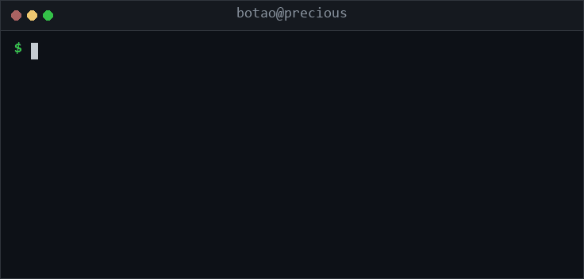
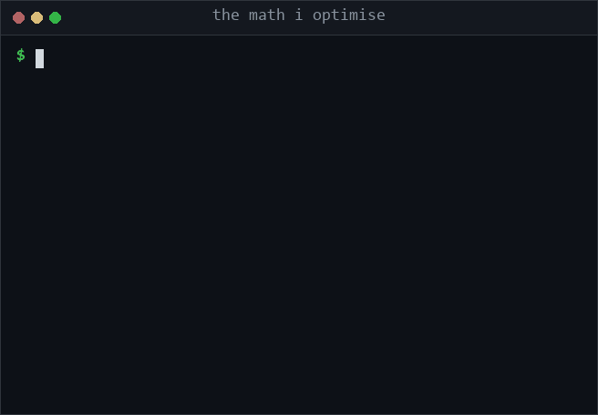
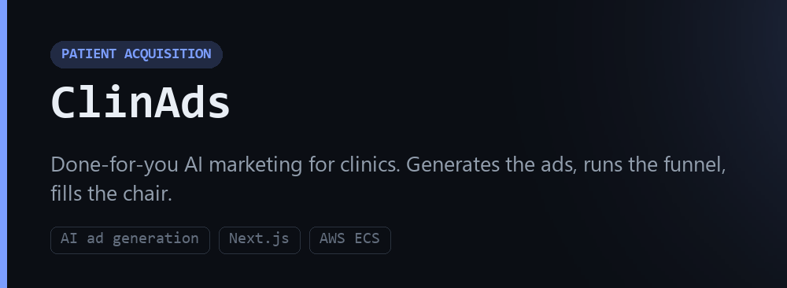
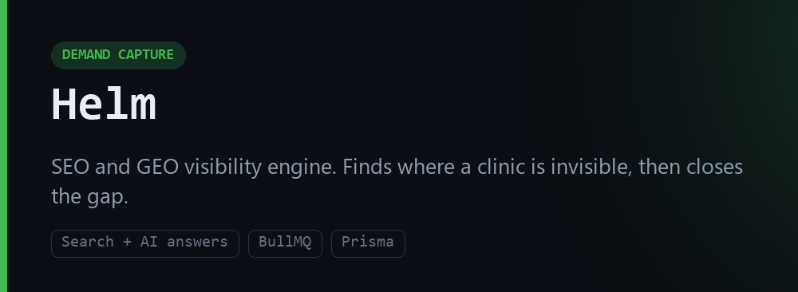
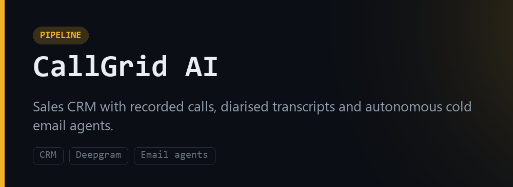
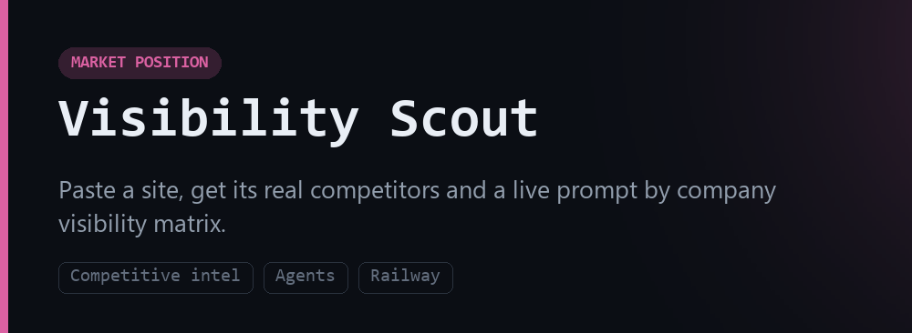
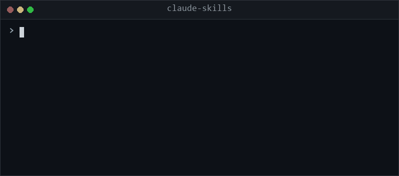
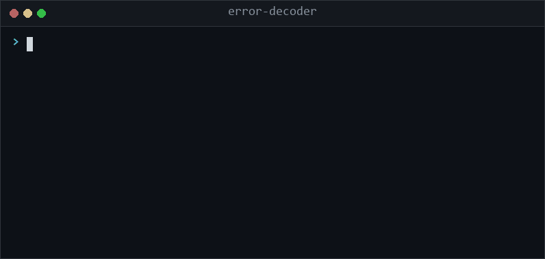
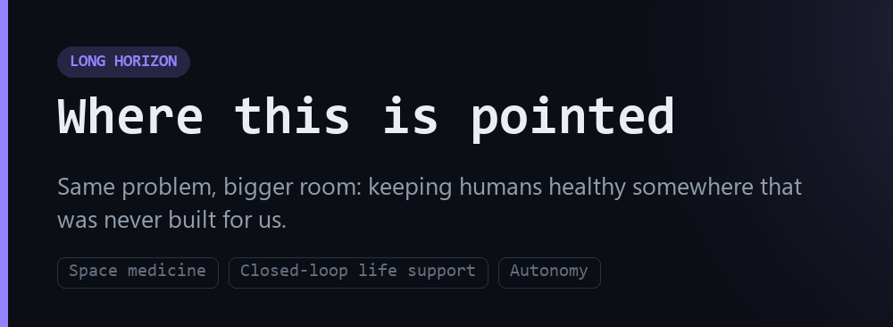

# 👋 Hi, I'm Botao, aka [botaoishere](https://github.com/botaoishere)

I build AI systems that make private clinics worth more.

Not "marketing". The whole machine: capturing demand, answering the phone, filling the chair, and following up until the patient books. Every system I ship points at one number, and it is not impressions.

---

## 📈 The number I optimise

A clinic is a business. It trades on a multiple of its annual EBITDA. Which means every marketing decision is really a valuation decision, and most clinics are optimising the wrong half of the equation.

Volume alone does not move it. Volume times case value times margin does.

Three levers, in the order they actually pay:

1. **Capture the demand that already exists.** Most clinics are invisible for the searches and the AI answers that carry real intent. That is free money sitting on the table.
2. **Stop leaking it at the front desk.** A missed call is a lost case. Most practices lose more revenue to a ringing phone than to a bad ad account.
3. **Raise case value, not just case count.** Margin compounds into the multiple. Volume without margin just buys you a busier, equally cheap business.

---

## 🏥 Core Work

### 🔷 ClinAds

Done-for-you AI marketing for clinics. It generates the creative, runs the funnel and reports on booked patients instead of vanity metrics. The ad generation engine builds on-brand creative from a clinic's own services, city and brand kit, so the output is usable rather than generic stock.

→ [getclinads.com](https://getclinads.com)

---

### 🟢 Helm

An SEO and GEO visibility engine. It measures where a clinic is invisible across both classic search and AI answers, then works the gap. GEO matters now because a growing share of high intent questions never reach a results page at all.

---

### 🟡 CallGrid AI

A sales CRM with recorded calls, diarised transcripts and autonomous cold email agents. Built because I wanted the pipeline instrumented the same way I instrument ad accounts: every touch measured, nothing living in someone's head.

---

### 🩷 Visibility Scout

Paste a website, get its real competitors and a live prompt by company visibility matrix. It answers a question most tools dodge: when a buyer asks an AI model about this category, who actually gets named, and who does not.

---

## 🛠️ Open Source

43 small repos, all of them things I wanted to exist while building the above. Single file where possible, zero dependencies where possible, no build step ever.

<table>
<tr>
<td width="50%"></td>
<td width="50%"></td>
</tr>
</table>

**Claude Code skills**
[claude-skills](https://github.com/botaoishere/claude-skills) ·
[commit-sage](https://github.com/botaoishere/commit-sage) ·
[pr-narrator](https://github.com/botaoishere/pr-narrator) ·
[test-first](https://github.com/botaoishere/test-first) ·
[regex-whisperer](https://github.com/botaoishere/regex-whisperer) ·
[dockerfile-doctor](https://github.com/botaoishere/dockerfile-doctor) ·
[sql-sanity](https://github.com/botaoishere/sql-sanity) ·
[env-doctor](https://github.com/botaoishere/env-doctor) ·
[dep-detox](https://github.com/botaoishere/dep-detox) ·
[a11y-sweep](https://github.com/botaoishere/a11y-sweep) ·
[error-decoder](https://github.com/botaoishere/error-decoder) ·
[rubber-duck](https://github.com/botaoishere/rubber-duck)

**Zero dependency CLIs**
[portkill](https://github.com/botaoishere/portkill) ·
[bigdir](https://github.com/botaoishere/bigdir) ·
[gitgone](https://github.com/botaoishere/gitgone) ·
[git-undo](https://github.com/botaoishere/git-undo) ·
[todo-radar](https://github.com/botaoishere/todo-radar) ·
[mdtoc](https://github.com/botaoishere/mdtoc) ·
[envdiff](https://github.com/botaoishere/envdiff) ·
[pkgweight](https://github.com/botaoishere/pkgweight) ·
[nocomment](https://github.com/botaoishere/nocomment) ·
[treemd](https://github.com/botaoishere/treemd) ·
[since](https://github.com/botaoishere/since) ·
[jsonpeek](https://github.com/botaoishere/jsonpeek) ·
[csvpeek](https://github.com/botaoishere/csvpeek) ·
[flaky](https://github.com/botaoishere/flaky) ·
[changelog-from-git](https://github.com/botaoishere/changelog-from-git) ·
[skill-forge](https://github.com/botaoishere/skill-forge)

**References worth bookmarking**
[git-rescue](https://github.com/botaoishere/git-rescue) ·
[terminal-one-liners](https://github.com/botaoishere/terminal-one-liners) ·
[regex-cookbook](https://github.com/botaoishere/regex-cookbook) ·
[prompt-patterns](https://github.com/botaoishere/prompt-patterns) ·
[agent-glossary](https://github.com/botaoishere/agent-glossary) ·
[awesome-context-engineering](https://github.com/botaoishere/awesome-context-engineering) ·
[awesome-claude-skills](https://github.com/botaoishere/awesome-claude-skills) ·
[awesome-tiny-tools](https://github.com/botaoishere/awesome-tiny-tools) ·
[awesome-windows-dev](https://github.com/botaoishere/awesome-windows-dev) ·
[readme-templates](https://github.com/botaoishere/readme-templates)

**Learn by doing**
[build-your-own-agent](https://github.com/botaoishere/build-your-own-agent) ·
[mcp-server-starter](https://github.com/botaoishere/mcp-server-starter) ·
[sql-in-30-queries](https://github.com/botaoishere/sql-in-30-queries) ·
[bash-safety-belt](https://github.com/botaoishere/bash-safety-belt) ·
[dotfiles-windows](https://github.com/botaoishere/dotfiles-windows)

---

## ⚙️ Tech Stack

`Next.js` · `React` · `TypeScript` · `Node.js` · `Python` · `Tailwind`
`Prisma` · `Postgres` · `Redis` · `Docker` · `AWS ECS` · `Cloudflare Workers` · `Vercel` · `Railway`

Comfortable anywhere there is a terminal. Most of what I ship runs on a queue and a cron.

---

## 🧠 How I work

- **Ship before it is perfect, then fix it in public.** A shipped thing generates information. A perfect thing sitting in a branch generates nothing.
- **Automate anything that takes two minutes by hand.** Twice is a coincidence. Three times is a script.
- **Instrument first.** If I cannot measure it, I am not optimising it, I am guessing at it.
- **Small tools over frameworks.** One file, no dependencies, no build step. It still runs in three years.
- **Read the numbers before the opinions.** Including my own.

---

## 🛰️ Where this is pointed

The long version of this work is not clinics.

Everything I am building is really one problem: how do you deliver competent healthcare when the expert is not in the room. Triage without a receptionist. Decision support without a queue. Follow-up without a human remembering to follow up. Right now that solves an economics problem on Earth, where the binding constraint is cost and attention.

Off Earth, the same constraint becomes physics. A crew on Mars sits somewhere between four and twenty four minutes of light delay from any specialist alive, one way, and there is no evacuation option. Autonomous medical decision making, closed-loop life support and systems that degrade gracefully when nobody can intervene stop being conveniences and become the mission.

So the through line is: **autonomous systems that keep humans healthy when there is nobody available to help.** Clinics are where that gets funded and battle tested. Space is where it eventually has to work.

Things I keep circling back to:

- Autonomous diagnostics and decision support under hard latency limits
- Closed-loop life support and resource recycling
- Fault tolerance and graceful degradation in systems nobody can service
- Orbital mechanics, because the math is genuinely beautiful
- The economics of mass to orbit, which is the real bottleneck on all of it

---

## 📊 Activity

---

## 📫 Contact

**Botao Tang**
📧 team@clinsight.ai
🔗 [github.com/botaoishere](https://github.com/botaoishere)
🏥 [getclinads.com](https://getclinads.com) · [heyclincy.com](https://heyclincy.com)

---

> A clinic is a business, not just a calling. Treat it like one and the valuation takes care of itself.

<!---
botaoishere/botaoishere is a special repository because its README.md appears on your GitHub profile.
--->
